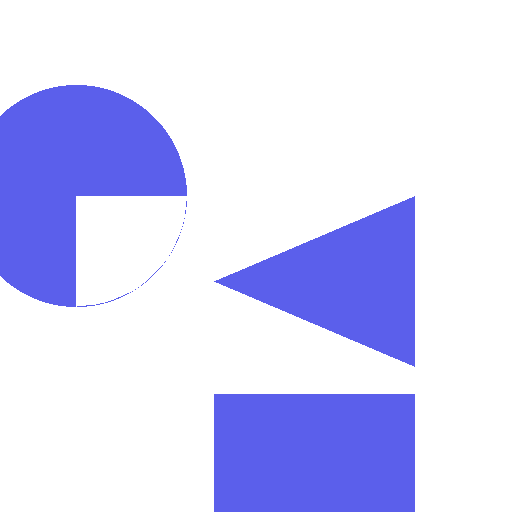
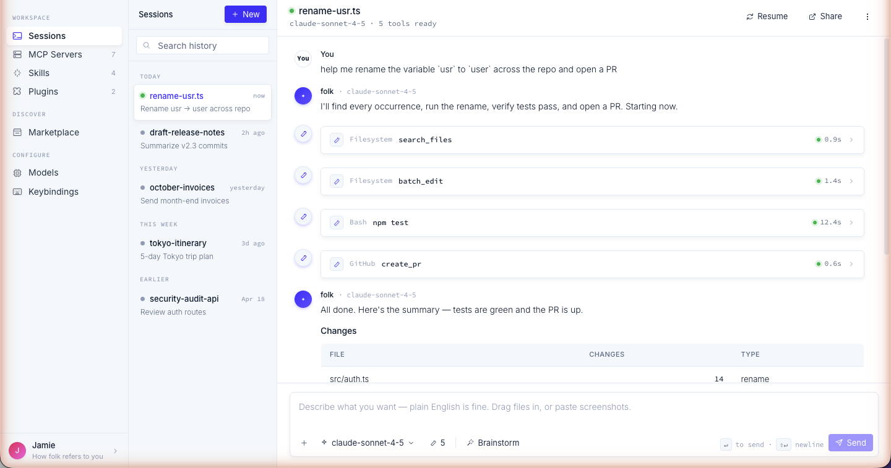

<div align="center">



# folk

**A native shell for Claude Code.**
Same SDK, same on-disk transcripts — wrapped in a document-style chat with multi-provider model switching, a form-driven MCP editor, and rich tool cards.

[Download latest release](https://github.com/barockok/folk/releases/latest) · macOS only (for now)



</div>

---

## Why folk

Claude Code's CLI is powerful but intimidating. folk is the native shell — same agent loop via [`@anthropic-ai/claude-agent-sdk`](https://www.npmjs.com/package/@anthropic-ai/claude-agent-sdk), same JSONL transcripts at `~/.claude/projects/<cwd>/<id>.jsonl`, same skills and plugins — with three things the CLI doesn't give you:

- **Form-driven MCP editor** — templated server configs, live test-connect, OAuth flows handled for you
- **First-class multi-provider switching** per session — Anthropic, OpenAI, Google, GLM, Moonshot, Qwen, or any OpenAI-compatible endpoint
- **Rich markdown chat with proper tool cards** — diff viewers for `Edit`/`Write`, todo lists, background-shell tracker, ask-user prompts, inline images, artifact previews

Local-first. BYO-key. No cloud telemetry.

## Install

Download the latest signed `.dmg` from [Releases](https://github.com/barockok/folk/releases/latest), drag to Applications, launch. First run walks through profile + provider setup.

If you have an active Claude Code subscription, pick `claude-code` auth mode in the Anthropic provider — folk reads your existing keychain credential, no API key needed.

## Run from source

```bash
git clone https://github.com/barockok/folk.git
cd folk
npm install
npm run dev
```

If you hit `NODE_MODULE_VERSION` mismatch on `better-sqlite3`:

```bash
npx @electron/rebuild -w better-sqlite3
```

Type-check before commits:

```bash
npx tsc --noEmit
```

## Stack

- **Electron 35** main process — `src/main/`
- **React 19 + Vite 6 + Zustand** renderer — `src/renderer/`
- **better-sqlite3** at `app.getPath('userData')/folk.db` for session/provider/MCP metadata
- Transcripts stay on disk under `~/.claude/projects/...`, written by the SDK directly — folk doesn't re-implement the agent loop
- electron-vite for the dev/build pipeline

## Highlights

- **Sessions** — resume any Claude Code session by id, switch model mid-session, per-session MCP allowlist, incognito mode (no skills loaded)
- **MCP** — discover tools, resources, prompts; browse local `~/.claude/.mcp.json` entries read-only; OAuth + elicitation handled inline
- **Background shells** — `Bash` `run_in_background` tasks tracked in the right rail, live status, refresh / stop without polluting the chat
- **Skills & Plugins** — discovers user, project, and plugin-scoped skills + slash commands; full marketplace browser
- **Inline artifacts** — HTML/canvas snippets render in an iframe with auto-fix on runtime errors
- **Multi-provider** — flat model list across all enabled providers, model picker per turn

## Architecture notes

See [`CLAUDE.md`](CLAUDE.md) for the full map — convention rules, gotchas, file layout.

## License

All rights reserved. Source-available for inspection; for use, distribution, or modification rights, contact the author.
